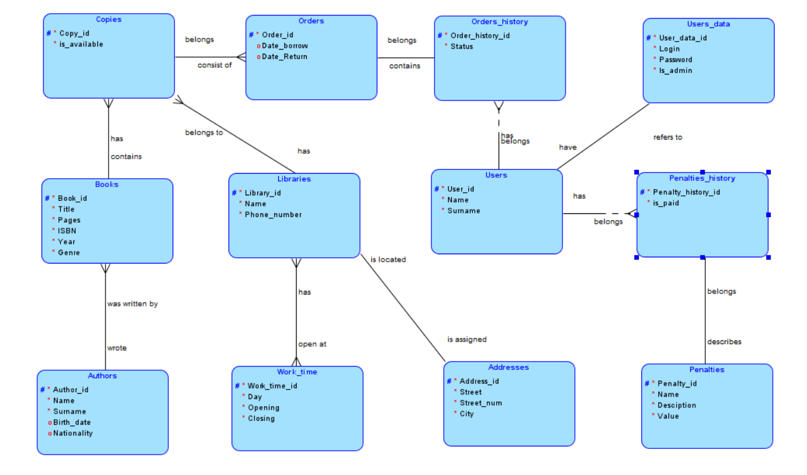
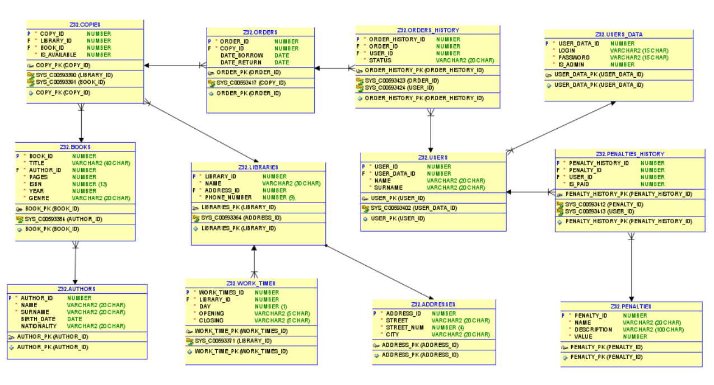

**Lista studentów:**
* Michał Bogiel
* Damian Pałyska
* Tomasz Wężowicz

**Treść zadania**

Biblioteka:
* wyszukiwanie książęk po różnych argumentach np. Autor, Tytuł
* dostępność w bibliotekach
* godziny otwarć bibliotek
* rezerwowacja książek
* użytkownicy
* termin oddania książek, kary za przetrzymanie
* historia wypożyczeń

**Wybrana technologia**

Java swing

# 
# 